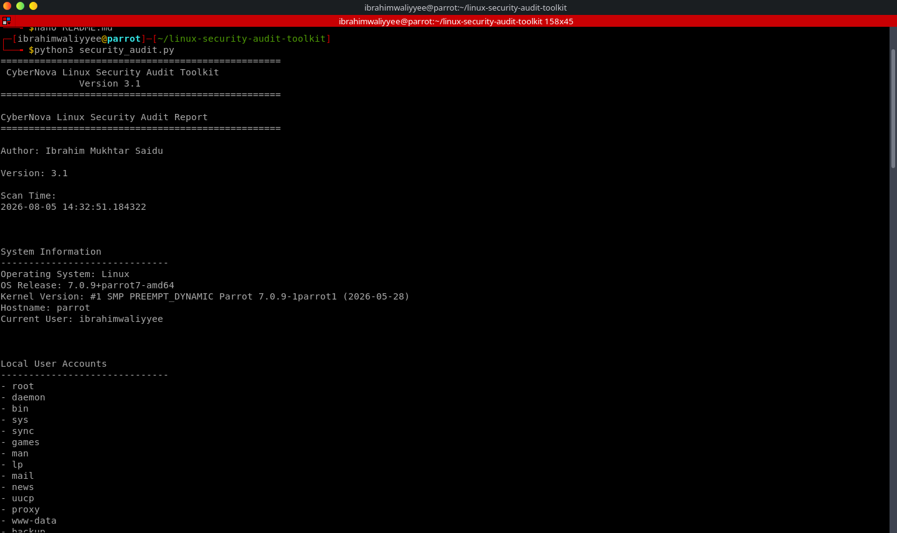

# 🛡️ CyberNova Linux Security Audit Toolkit

A Python-based Linux security auditing toolkit designed to analyze system security posture, identify common security risks, and generate automated audit reports.

Built for cybersecurity learning, Linux administration practice, and authorized security assessments.

---

## 🚀 Features

- System information collection
- Local user account enumeration
- Running service analysis
- Listening port detection
- World writable file detection
- SUID binary auditing
- Security risk analysis
- Security score calculation
- Automated audit report generation

---

## 🖥️ Screenshot



---

## 🛠️ Technologies Used

- Python 3
- Linux
- System Administration
- Security Auditing
- Linux Command Line
- Security Analysis

---

## 📦 Installation

Clone the repository:

```bash
git clone https://github.com/ibrahim-mukhtar-saidu/linux-security-audit-toolkit.git
